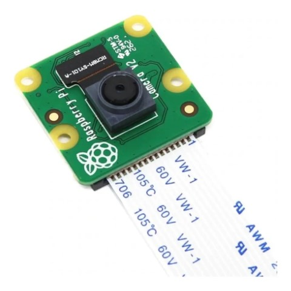
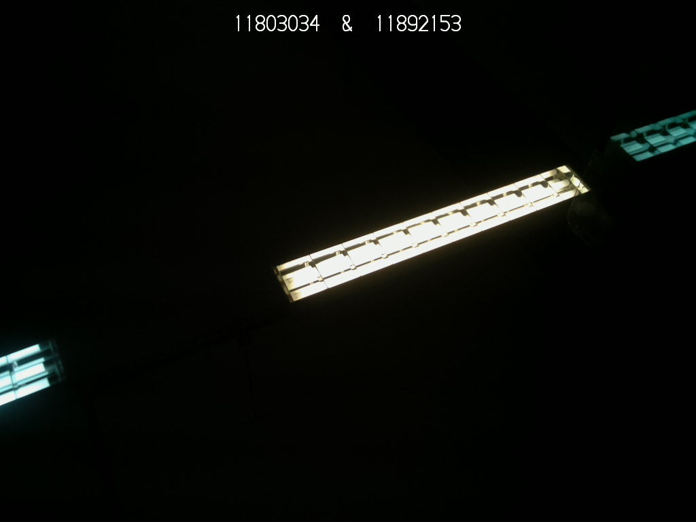
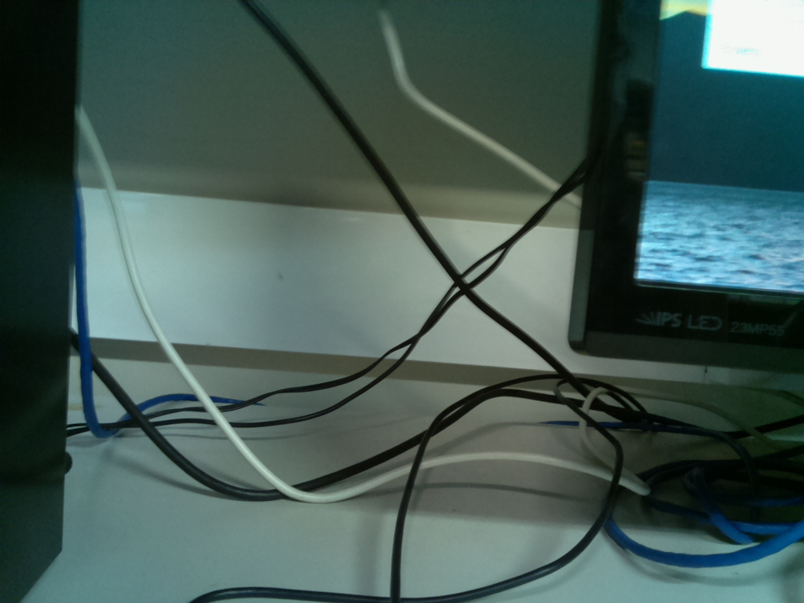
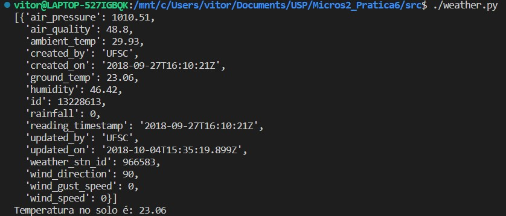

# SEL0337-Aplicação de Microprocessadores-II pratica 6

## Objetivo

A presente atividade prática teve como objetivo introduzir ao alunos a utilização de periféricos da raspberry pi, apresentntar a utilização de APIs presentes na Web para aquisição de dados além de  introduzir o conceito de controle distribuida de versões por meio da plataforma GitHub. 

## Materiais

Para a realização dessa atividade foi utilizado o módulo de camera nativo da raspberry pi, ele é conectado diretametne a placa e permite e é capaz de gravar tanto fotografias quanto videos.

## Desenvolvimento 

### Visão Computacional

Para desenvolver a aplicação responsáver por tirar fotos e gravar vídeos foi utilizado o pacote picamera, responsável por fazer a comunicação com esse periférico. com esse pacote é possível selecionar tanto a resolução da imagem quanto o nome do arquivo quanto possiveis anotações na figura.

https://user-images.githubusercontent.com/43122957/208935095-85b7fcc1-3386-4008-a9a3-4f65f812eb6f.mp4

Os arquivos foram convertidos para formatos mais convencionais de vídeo e imagem para que pudessem ser reproduzinos no GitHub. Além disso, o código desenvolvido nessa prática encontra-se em [camera.py](src/camera.py).

### API meteorológica

Na segunda parte do experimento foi implementado um programa que consultoria dados meteorolégicos por meio de uma API e informa os dados para o usuário por meio do terminal.
Para realizar essa atividade foram utilizados os pacotes requests (cuja função é  tornar as solicitações HTTP mais simples e mais fáceis de usar) e pprint utilizado para realizar impreções mais amigaveis no terminal.

